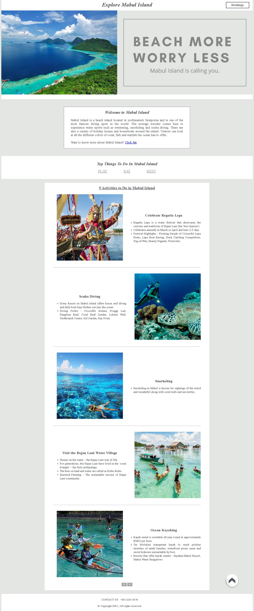
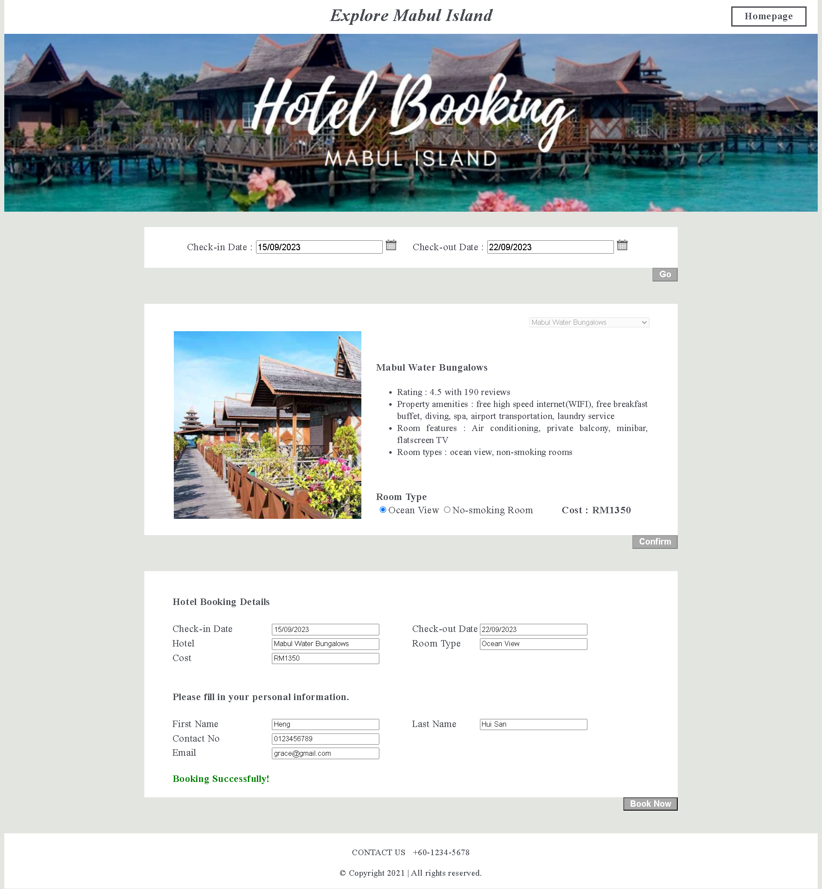

<h1 align="center" id="title">Mabul Island Toursim Website</h1>

<p id="description">A tourism website that strives to provide travelers with an informative platform, offering travel guides to enhance their trip planning experience and the ability to book hotels on Mabul Island, Semporna, Sabah, Malaysia.</p>

## Table of Contents

- [💻 Tech Stack](#tech-stack)
- [🛠️ Quick Start](#quick-start)
- [🖼️ Project Screenshots](#project-screenshots)


<br />

## 💻 Tech Stack

- **Visual Studio 2019** : Primary development tool
- **C#** : Server-side scripting
- **HTML & CSS** : Client-side scripting
- **Canva** : Component design


<br />

## 🛠️ Quick Start

### 1. Prerequisites
Before you begin, ensure that you have the following software versions installed:

- **Visual Studio**: Install Visual Studio from the [Microsoft website](https://visualstudio.microsoft.com/downloads/).

### 2. Clone the Repository
Clone this repository to your local machine using:

```bash
git clone https://github.com/henghuisan/mabul-island-tourism-website.git
```
### 3. Launch Application
Open the project folder and click on `MabulIsland.sln`

After you've been directed to Visual Studio, you can proceed to run the application.

<br />

## 🖼️ Project Screenshots

### 1. Homepage

<br />

### 2. Hotel Reservation Page


